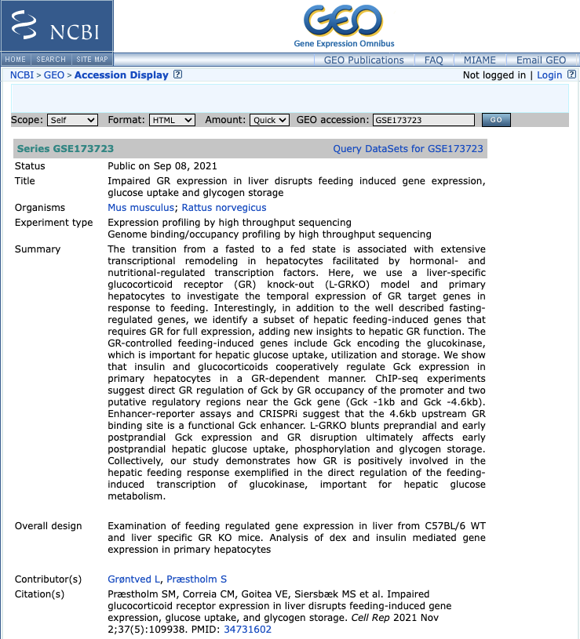
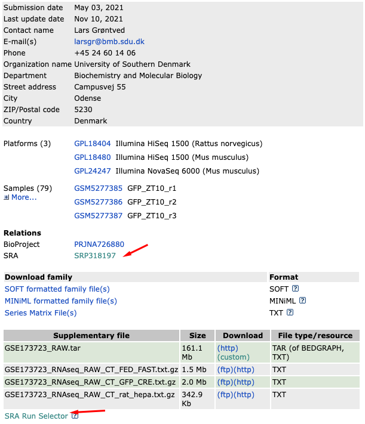
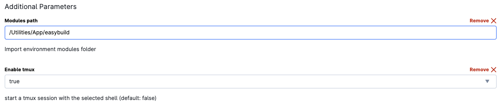

# Accessing public genomic data: UCloud, Slurm, SRA-Toolkit

This guide provides instructions for accessing public genomic data from the Sequence Read Archive (SRA) using UCloud, Slurm, and SRA-Toolkit. It covers steps to navigate GEO datasets, download metadata and accession lists, and execute single and parallel downloads efficiently on an HPC cluster.

## Downloading data from SRA

This time let’s use the other GEO dataset from the paper “GSE173723”. [**Click here to access the GEO summary page of this dataset**](https://www.ncbi.nlm.nih.gov/geo/query/acc.cgi?acc=GSE173723)



At the bottom of the there is a link for **"SRA"** under the heading **"Relations"**.



Clicking on this link takes you to a page that lists all the biological samples for the study. If you are interested in only one sample, you could follow the relevant link and find its runs. However, generally it is necessary all or several samples. Therefore, to obtain a comprehensive list, use the **"Run Selector"**. 

## Run selector

The **Run Selector** provides all the information for the study samples, including a table of metadata at the top. Below, find a summary line detailing the total number of runs in the study, and the option to download the **RunInfoTable** or **Accession List**, in text format. The **RunInfoTable** summarizes metadata for all runs, and the **Accession List** contains SRR accession numbers.

Each run and its metadata are listed, with clickable rows to select desired runs.

**Download the Accession list** for the data you are interested. **Copy the contents of this downloaded file to a new file on the cluster** using the following commands:

```` bash
mkdir -p /work/data/GSE173723   # make a new directory

cd /work/data/GSE173723    # change to that directory

vim SRR_Acc_List_GSE173723.txt   # paste into this new file and save
````

## General Usage
Clone Repository and copy the script to your Scripts folder

```` bash
git clone <repository-url> 
cd <repository-directory> 
````

### Downloading a single SRR

To download a single SRR, it is possible to convert that directly to a fastq file on the server, using SRA toolkit which is a toolkit created by NCBI. 

On UCloud, start a **Terminal Ubuntu** run:
  - Set the modules path to **FGM \> Utilities \> App \> easybuild**



```bash
module load SRA-Toolkit

## Given the SRR#, fastq-dump will only download the fastq.gz version of the SRR
fastq-dump --split-3 --gzip SRR14402225
```
For pair-end data, use --split-files or --split-3 for improved handling of orphan reads. Include --gzip for compressed fastq.gz files.


### Parallel download of multiple SRR

Utilize two scripts for parallel downloads: **inner_script.slurm** and **sra_fqdump.sh**.

We are going to use these two scripts to do this efficiently in parallel. The first script (**inner_script.slurm**) contains the command to do a fastq dump on a given SRR number, where the SRR variable is given using a positional parameter. The second script (**sra_fqdump.sh**) loops through the list of SRRs, and calls the first script from within the loop, passing it the next SRR in the list. In this way (by calling a script within a script) we will start a new job for each SRR download, and download all the files at once in parallel – much quicker than if we had to wait for each one to run sequentially.

1.  **Modify SLURM Parameters (Optional):** Open a script (**inner_script.slurm.sh**) and modify SLURM parameters at the beginning of the file, such as account, output file, email notifications, nodes, memory, CPU cores, and runtime.
2. On UCloud, start a **Terminal Ubuntu** run:
   - Set the modules path to **FGM \> Utilities \> App \> easybuild**
  
    - Include your Scripts folder and the folder where the data will be downloaded
   - **Notes:**
     - Match the job CPUs to the amounts requested in the script.
     - Make sure the scripts have executing permission. If not run: `chmod 700 script.sh`
     - If you modify the memory parameter in the script, specify 5-10% less
       than the memory available in the terminal run.
     - Enable **tmux** for best practice.
   - Include your Scripts folder and the destination folder where to download the data.

1.  **Run the second script to submit the first script to the SLURM cluster:**
    ```bash
    path_to/sra_fqdump.sh <input-SRR-List.txt>
    ```  
    Replace **input-SRR-List.txt** with the file containing the **Accession List**.

2.  **Monitor Job:** You can monitor the job using the SLURM commands,
    such as squeue, scontrol show job <job-id>, and check the log files
    generated.

**Notes:** Find test data in UCloud at the FGM project (Utilities/Example_data/GEO_SRA)
